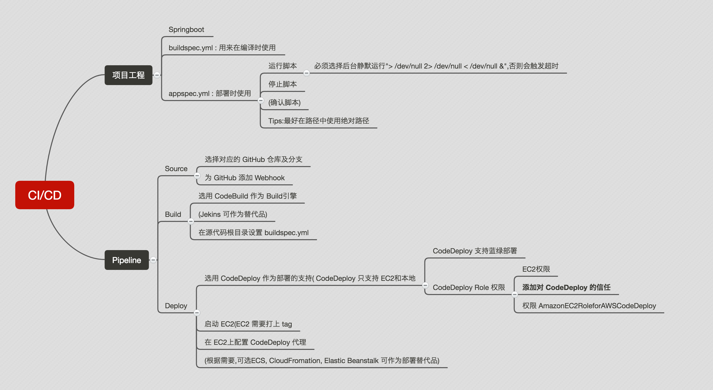

# 基于 AWS 服务的 微服务 CI/CD 解决方案

可将Spring boot 编写的Maven工程代码上传至**GitHub** 后,可以快速自动部署到指定 EC2 实例

本仓库中内容主要包括

- 用于 CodeBuild 的**编译**配置文件: [buildspec.yml](buildspec.yml)

- 用户 CodeDeploy 的**部署**配置文件: [appspec.yml](appspec.yml)

- **测试用** Maven 工程: 

  - 使用 Spring boot 编写

  - 当访问 "< ec2 公有 ip>:1234/list" 时会显示数据库中的内容(位与 BJS 的一个 RDS MySQL 实例, 不保证以后可用), 如表

    | username | age  |
    | -------- | ---- |
    | Tom      | 12   |
    | Jerry    | 10   |

  - 当访问 "< ec2 公有 ip>:1234/hello" 时会显示"Hello World"

## 方案组成

- 项目工程组件
  - Maven
  - Spring boot
  - AWS RDS
- 部署流程组件
  - GitHub
  - AWS CodePipeline
  - AWS CodeBuild
  - AWS CodeDeploy
- 部署环境
  - AWS EC2

